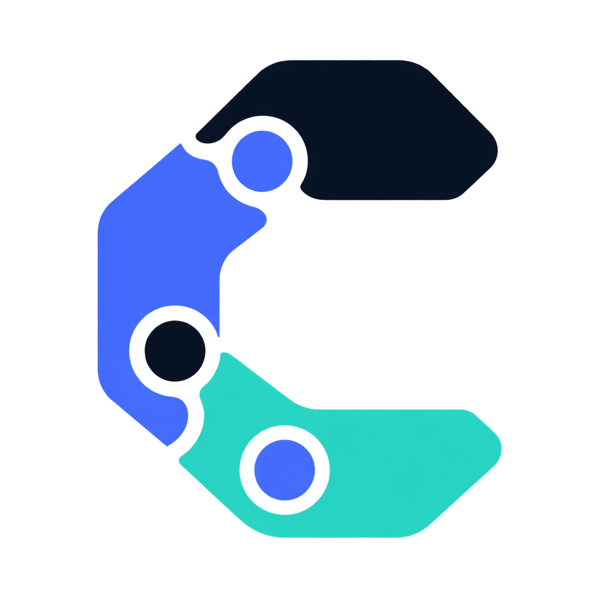
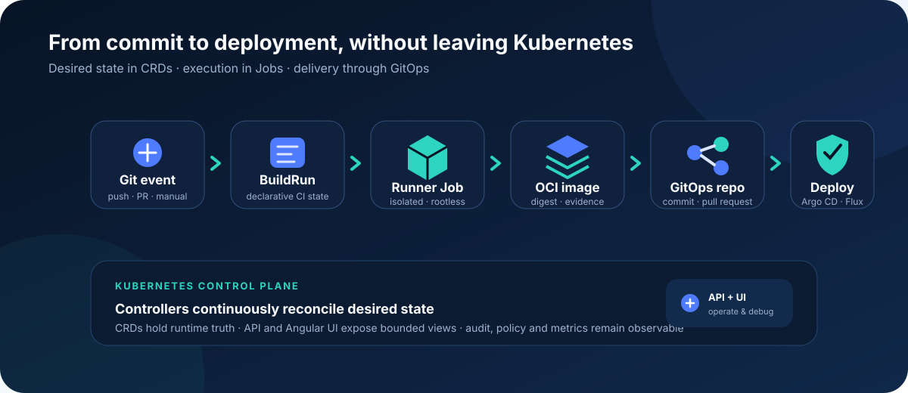
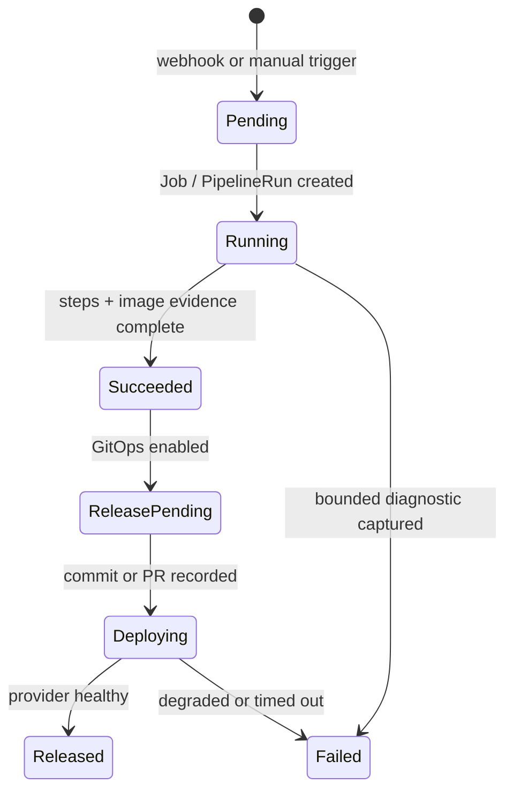

<p align="center">
  
</p>

<h1 align="center">cloudivision</h1>

<p align="center">
  <strong>Kubernetes-native CI/CD, from verified source event to observable GitOps release.</strong>
</p>

<p align="center">
  Pipelines are custom resources. Builds run as isolated Kubernetes Jobs.<br>
  Deployments happen through Git—not from the CI runner.
</p>

<p align="center">
  <a href="https://github.com/alekpopovic/cloudivision/actions/workflows/ci.yaml"></a>
  <a href="https://github.com/alekpopovic/cloudivision/actions/workflows/docs-pages.yaml"></a>
  
  
  
  
</p>

> [!IMPORTANT]
> v0.2.0 is an alpha release. The clean-cluster gate passes, but the default
> disabled authentication mode is for development only. Read the
> [final gate](docs/readiness/v0.2-final-gate.md) before production evaluation.

## How it works

<p align="center">
  
</p>

The Kubernetes API remains the source of runtime truth. Controllers reconcile
desired state idempotently, the runner creates artifacts, and GitOps controllers
own target-cluster deployment.



## Why cloudivision

| | Capability | What it gives you |
| --- | --- | --- |
|  | **Kubernetes-native state** | Projects, repositories, pipelines, builds, environments, and releases live as CRDs with status. |
|  | **Pluggable execution** | Kubernetes Jobs are the MVP executor; Tekton remains behind the same interface. |
|  | **Artifact-first CI** | Rootless build paths, immutable image evidence, policy, SBOM, scanning, signing, and provenance hooks. |
|  | **GitOps delivery** | Direct commits or pull requests update deployment repositories; Argo CD and Flux can report health. |
|  | **Secure defaults** | Non-root workloads, no Docker socket, no default privilege, namespaced runner RBAC, signed webhooks, and redaction. |
|  | **Operational visibility** | Angular debugging UI, CLI, structured conditions, logs, metrics, events, audit adapters, dashboards, and alerts. |

## Quickstart on kind

Prerequisites: Docker, kind, kubectl, Helm, Go 1.26+, and Node.js 24/npm.

```sh
git clone https://github.com/alekpopovic/cloudivision.git
cd cloudivision
./hack/kind-create.sh
./hack/kind-load-images.sh
./hack/install-dev.sh
```

Run the credential-free sample:

```sh
kubectl apply \
  -f deploy/examples/project.yaml \
  -f deploy/examples/repository.yaml \
  -f deploy/examples/pipeline-template-nodejs.yaml \
  -f deploy/examples/environment-dev.yaml \
  -f deploy/examples/buildrun-manual.yaml

kubectl -n cloudivision get buildrun demo-buildrun-manual -w
kubectl -n cloudivision logs \
  -l cloudivision.io/buildrun=demo-buildrun-manual \
  --tail=100
```

The sample clones Docker's public getting-started Node.js application and verifies
its source without requiring BuildKit or registry credentials. Continue with the
[full kind quickstart](docs/getting-started/quickstart-kind.md) or
[create your first build](docs/getting-started/first-build.md).

### Open the API and UI

```sh
# terminal 1
kubectl -n cloudivision port-forward \
  svc/cloudivision-cloudivision-api 8080:8080

# terminal 2
kubectl -n cloudivision port-forward \
  svc/cloudivision-cloudivision-web 4200:80
```

- API health: `http://localhost:8080/healthz`
- Angular UI: `http://localhost:4200`

Optional CLI check:

```sh
go build -o bin/cloudivision ./cmd/cloudivision
CLOU_DIVISION_API_URL=http://localhost:8080 \
  bin/cloudivision -n cloudivision doctor
```

## Platform map

| Component | Responsibility | Source |
| --- | --- | --- |
| Controller | Reconciles Projects, BuildRuns, Jobs, Releases, RBAC, and network policy | [`cmd/controller`](cmd/controller), [`internal/controller`](internal/controller) |
| API | REST facade, webhook intake, auth, logs, providers, and audit | [`cmd/api`](cmd/api), [`internal/api`](internal/api) |
| Runner | Clones source, executes steps, builds/pushes images, and records evidence | [`cmd/runner`](cmd/runner), [`internal/runner`](internal/runner) |
| CLI | Developer and operator workflows over the API | [`cmd/cloudivision`](cmd/cloudivision), [`internal/cli`](internal/cli) |
| Web | Angular + TypeScript + Tailwind operations UI | [`web`](web) |
| APIs | `cicd.cloudivision.io/v1alpha1` domain and generated CRDs | [`api/v1alpha1`](api/v1alpha1), [`config/crd`](config/crd) |
| Packaging | Helm chart, example resources, and local kind automation | [`charts/cloudivision`](charts/cloudivision), [`deploy/examples`](deploy/examples), [`hack`](hack) |

## Security model

cloudivision treats repository code as untrusted:

- runner workloads are non-root and resource-bounded;
- privileged containers, hostPath, Docker-in-Docker, and Docker socket mounts are
  not defaults;
- Project namespaces receive scoped ServiceAccounts, Roles, and RoleBindings;
- the API permission template is bound only inside reconciled Project namespaces;
- webhook signatures are checked before BuildRun creation;
- credentials and known secret values are redacted from logs and status; and
- CI runs rendered Helm security checks and a production dependency audit.

Start with the [threat model](docs/security/threat-model.md),
[runner security](docs/security/runner-security.md), and
[operator hardening guide](docs/operations/security-hardening.md).

## Documentation

Browse the modern, searchable [cloudivision documentation site](https://alekpopovic.github.io/cloudivision/) or use the source links below.

| Start | Build and release | Operate | Extend |
| --- | --- | --- | --- |
| [Documentation home](docs/index.md) | [First build](docs/getting-started/first-build.md) | [Helm install](docs/operations/install-helm.md) | [Architecture](docs/development/architecture.md) |
| [kind quickstart](docs/getting-started/quickstart-kind.md) | [First webhook](docs/getting-started/first-webhook.md) | [Upgrade](docs/operations/upgrade.md) | [Add a provider](docs/development/adding-provider.md) |
| [CLI reference](docs/reference/cli.md) | [First GitOps release](docs/getting-started/first-release.md) | [Troubleshooting](docs/operations/troubleshooting.md) | [Contributing](docs/development/contributing.md) |
| [CRD reference](docs/reference/crds.md) | [Policy model](docs/concepts/policy.md) | [Observability](docs/operations/observability.md) | [Brand system](docs/brand.md) |

## Release status

- Version: **v0.2.0 alpha**
- Readiness decision: **ship with known issues**
- Next increment: v0.3 roadmap
- Prioritized work: [product backlog](docs/roadmap/backlog.md)
- Changes: [CHANGELOG.md](CHANGELOG.md)

Useful local gates:

```sh
mise exec -- go test ./...
mise exec -- go vet ./...
npm --prefix web ci
npm --prefix web run build
helm template cloudivision charts/cloudivision --include-crds
make security-check
```

Contributions should preserve the core boundary: **CI creates artifacts; CD
deploys through GitOps.** See [contributing](docs/development/contributing.md) and
the [release process](docs/development/release-process.md).
