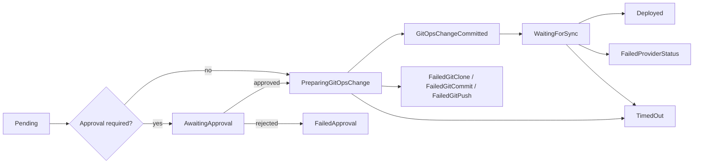

# Release lifecycle

A Release promotes one immutable build artifact by changing desired state in a
GitOps repository. The runner never deploys directly. The Release controller
validates policy, records a Git commit exactly once, and then observes the
configured provider until deployment is confirmed.

## States

| Phase | Meaning | Operator action |
| --- | --- | --- |
| `Pending` | The controller has not started promotion. | Check controller health if it persists. |
| `AwaitingApproval` | Policy requires approval; no Git clone or write occurs. | Review the digest and supply-chain evidence, then approve or reject. Approver and timestamp are copied into status. |
| `PreparingGitOpsChange` | Image, Environment, policy, and GitOps configuration passed validation; repository work is starting. | Inspect repository access if it persists. |
| `GitOpsChangeCommitted` | The change was committed and pushed. `status.gitCommit` and the checkpoint annotation identify it. | Verify the commit in the GitOps repository. |
| `WaitingForSync` | Argo CD or Flux has not yet reported both synced and healthy. | Inspect `status.deployment.syncStatus` and `healthStatus` separately. |
| `Deployed` | The provider confirmed sync and health, or the generic provider policy treats a commit as sufficient. | No action required. |
| `RolledBack` | A rollback completed. | Verify the restored digest and provider health. |
| `FailedValidation` | BuildRun, Environment, artifact, or policy input is invalid. | Read `status.failure` and fix the referenced resource. |
| `FailedApproval` | A required approval was rejected. | Create a new Release after addressing the rejection. |
| `FailedGitClone` | Repository clone or branch checkout failed. | Check URL, branch, network, and read credentials. |
| `FailedGitCommit` | Manifest update, staging, commit, or commit lookup failed. | Check strategy/path and repository contents. |
| `FailedGitPush` | The commit exists locally but push failed. | Check write credentials and branch protection; the checkpoint prevents duplicate commits after a successful push. |
| `FailedProviderStatus` | Provider status could not be read due to a non-transient error. | Check provider RBAC, API availability, and application reference. |
| `TimedOut` | `spec.deploymentTimeout` elapsed after processing started. | Diagnose the current phase and create a new Release after recovery. |

`deploymentTimeout` defaults to `30m`. A provider's temporarily unavailable
application is not immediately terminal: the Release remains `WaitingForSync` and
is retried. Other provider errors preserve a safe reason and message in
`status.failure` and emit a Kubernetes Warning Event.

## Idempotency

The controller writes the pushed commit to both `status.gitCommit` and the
`cloudivision.io/gitops-commit` annotation. The annotation is persisted before the
status transition so a status-update conflict cannot create a second commit.
Repeated reconciliation reuses that checkpoint and only reads deployment state.
Argo CD status retains `syncStatus` and `healthStatus` as separate values because
`Synced` does not imply `Healthy`.
